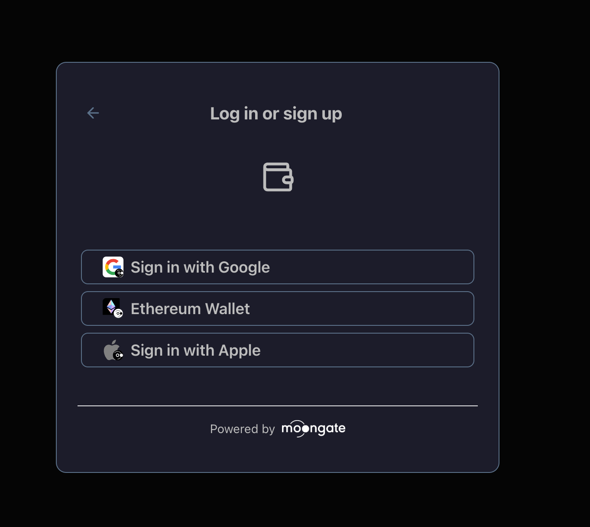

# Moongate Adapter Example

This is a [Next.js](https://nextjs.org) project demonstrating how to integrate the Moongate SDK wallet adapter.

## Prerequisites

- Node.js 18+ installed
- pnpm (recommended) or npm
- A Moongate API key (see below)

## Getting Your API Key

**Important:** Before you can use the Moongate SDK, you need to obtain an API key:

1. Visit [partner.moongate.one](https://partner.moongate.one)
2. Create an account
3. Wait for approval from the Moongate team
4. Once approved, you'll receive your API key

This is a required first step - the SDK will not work without a valid API key.

## Installation

### 1. Clone and Install Dependencies

```bash
# Install dependencies using pnpm (recommended)
pnpm install

# Note: If using npm, you may encounter workspace protocol errors
# with @moongate/sdk. Use pnpm instead.
```

### 2. Install Moongate SDK

```bash
pnpm add @moongate/sdk
```

**Important:** The `@moongate/sdk` package uses workspace dependencies that are not compatible with npm. Use `pnpm` to avoid installation errors.

### 3. Set Up Environment Variables

Create a `.env.local` file in the root directory:

```bash
cp .env.example .env.local
```

Add your Moongate API key:

```
NEXT_PUBLIC_MOONGATE_API_KEY=your_moongate_api_key_here
```

### 4. Configure the SDK

#### Add SDK Styles to Layout

In `app/layout.tsx`, import the Moongate SDK styles:

```tsx
import "@moongate/sdk/styles.css";
```

Add the `moongate-wallet-sdk` class to your `<body>` tag:

```tsx
<body className="moongate-wallet-sdk">
  {children}
</body>
```

#### Integrate the Provider and Button

In `app/page.tsx`, wrap your app with the `MoonGateProvider` and add the connect button:

```tsx
'use client';
import { MoonGateProvider, MoongateConnectButton } from '@moongate/sdk';

export default function Home() {
  return (
    <MoonGateProvider apiKey={process.env.NEXT_PUBLIC_MOONGATE_API_KEY!}>
      <div className="min-h-screen flex items-center justify-center">
        <MoongateConnectButton />
      </div>
    </MoonGateProvider>
  )
}
```

## Running the Project

Start the development server:

```bash
pnpm dev
```

Open [http://localhost:3000](http://localhost:3000) to see the Moongate wallet connect button.

## Example



The Moongate connect button will appear centered on the page, allowing users to connect their wallet.

## Known Issues

### DialogTitle Accessibility Warning

You may see a console warning about `DialogTitle` accessibility:

```
`DialogContent` requires a `DialogTitle` for the component to be accessible for screen reader users.
```

This is a known issue in the Moongate SDK itself (not your code). The app will function correctly despite this warning.

## Project Structure

```
adapter-example/
├── app/
│   ├── layout.tsx       # Root layout with SDK styles
│   ├── page.tsx         # Home page with Moongate integration
│   └── globals.css      # Global styles
├── .env.local           # Environment variables (not committed)
├── .env.example         # Environment variables template
└── package.json         # Dependencies
```

## Learn More

- [Moongate Documentation](https://docs.moongate.com)
- [Next.js Documentation](https://nextjs.org/docs)
- [@moongate/sdk on npm](https://www.npmjs.com/package/@moongate/sdk)


### API Key not loading

Make sure:
1. Your `.env.local` file exists in the project root
2. The environment variable starts with `NEXT_PUBLIC_`
3. You've restarted the dev server after creating/editing `.env.local`
